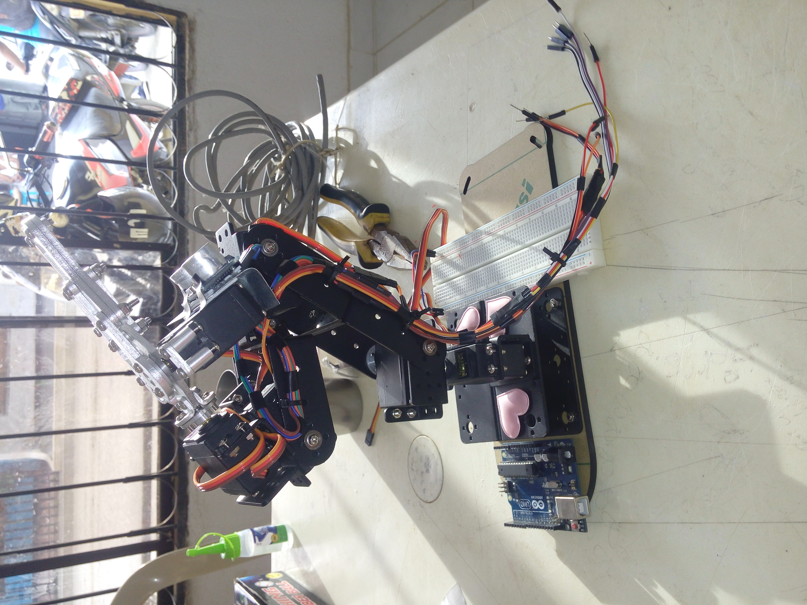

# Early Embedded Projects — University Period (2016–2018)

Collection of Arduino-based robotics projects developed during my 
Systems Engineering degree at Universidad Cooperativa de Colombia.

These projects represent my first hands-on work with microcontrollers,
actuator control, sensor integration, and autonomous behavior logic.

---

## Projects

### BB-9 Robot Series
Hardware base: repurposed RC car with self-locking differential,
rebuilt from scratch for autonomous operation.

| File | Description |
|------|-------------|
| `src/BB-9.ino` | Sequential movement control — motor + steering |
| `src/BB-9_EVASOR.ino` | Obstacle avoidance with 4 ultrasonic sensors + line follower |
| `src/BB-9_SUMO.ino` | Sumo competition logic — ring detection + enemy targeting |

The physical robot was built by recycling a RC car chassis, 
repurposing its self-locking differential as the drive system.
No off-the-shelf robot kit — hardware designed and assembled 
from available components.

### IZAYA Motor Control Series
Independent dual-motor architecture (vs. motor+steering in BB-9).

| File | Description |
|------|-------------|
| `src/IZAYA_MOTORES.ino` | Dual independent motor control — directional logic |
| `src/IZAYA_SUMO.ino` | Sumo variant with ultrasonic + line follower |

> Note: Remote control version (`IZAYA_MOTORES`) was started 
> but not completed — documented here as-is for portfolio continuity.

### Pololu Zumo Platform
Projects using the Pololu Zumo robot with its dedicated libraries.

| File | Description |
|------|-------------|
| `src/POLOLU_RobotSumo.ino` | Sumo competition with ultrasonic targeting |
| `src/POLOLU_Seguidor_Linea.ino` | PID-based line follower |

The line follower implements a basic proportional-derivative 
controller — first contact with control systems concepts.

### Semaforo
Traffic light simulation — introductory GPIO and timing exercise with ultrasonic targeting.

| File | Description |
|------|-------------|
| `src/Semaforo.ino` | Traffic light simulation |
| `src/Ultrasonido_Semaforo.ino` | Light with ultrasonic sensor |

### Color Detection Robotic Arm

> ⚠️ The original source code is not available (corrupted file).

This project consisted of a robotic arm capable of detecting colors and reacting accordingly (e.g., object classification or specific movements based on detected color).

**System overview:**
- 5-DOF robotic arm actuated using servo motors
- Ultrasonic sensor for distance detection and object positioning
- Color sensor module (RGB-based; exact model not preserved) used for object identification

**My contribution:**
- Servo motor control tuning for coordinated multi-axis movement
- Ultrasonic sensor integration and calibration for reliable distance measurement
- Physical assembly, wiring, and hardware adjustments
- Iterative testing and calibration of movement precision and detection timing


---
## Technical progression visible in this repo
```
GPIO + timing (Semaforo)
    → Sensor integration — distance measurement (Ultrasonido)
        → Actuator control (BB-9 basic)
            → Multi-sensor fusion (BB-9 Evasor)
                → Autonomous competition logic (BB-9 Sumo)
                    → PD control systems (Pololu line follower)
                        → Hardware-software co-design (Color Detection Arm)
```
---

## Build evidence

Hardware was built from scratch using recycled components.
These clips show the actual build — imperfections included.

| Video | Description |
|-------|-------------|
| `MEDIA/Video BB-9 Fail.mp4` | First autonomous run — wheel detachment visible |
| `MEDIA/Video BB-9 Funcional.mp4` | Steering working both directions — autonomous mode |
| `MEDIA/Video Seguidor Linea.mp4` | Line follower robot demo |
| `MEDIA/Video Semaforo.mp4` | Light with ultrasonic |

> The wheel falling off in the first clip is intentional to keep here.
> It's what real hardware development looks like.

---

## Hardware notes

- **BB-9 base**: repurposed RC car — self-locking differential 
  retained as drive mechanism
- **Platform**: Arduino (UNO, Leonardo, etc)
- **Sensors**: HC-SR04 ultrasonic, TCRT5000, QTR reflectance array (Pololu)
- **Period**: 2016–2018

---

## What came next

Same hands-on approach, higher complexity.  
→ [moto-telemetry](https://github.com/IzayaJL96/moto-telemetry) 
— open-source wearable telemetry system for motorsport (2026)

---

## License
GPL v3 — use it, fork it, build on it. 
If you improve it, keep it open.
